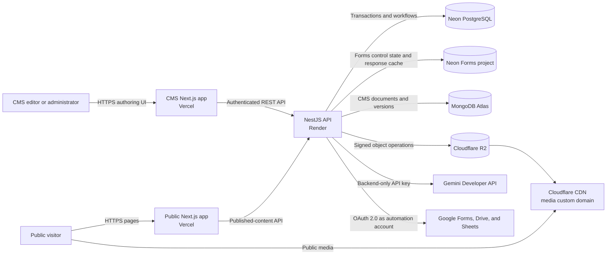
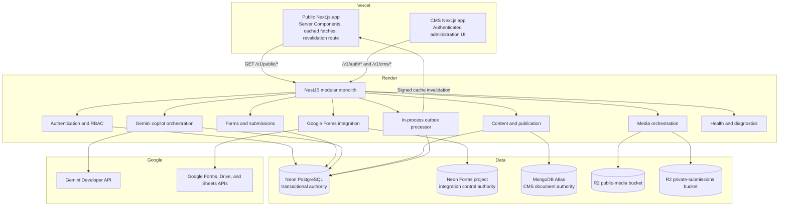
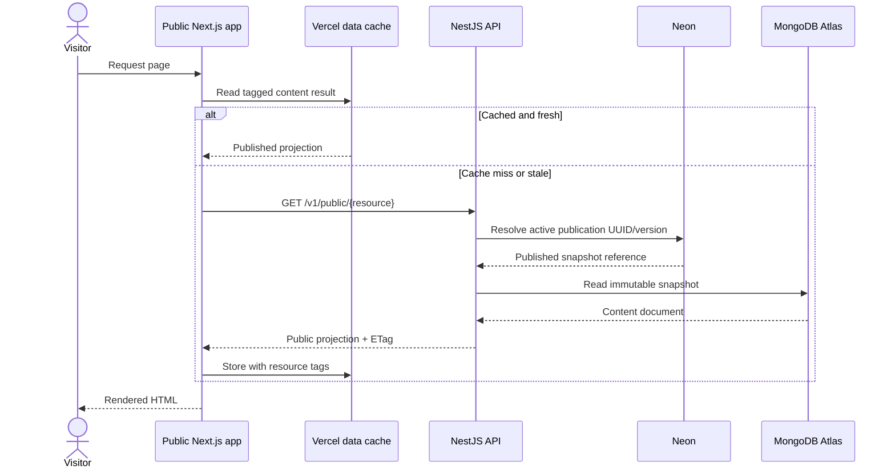
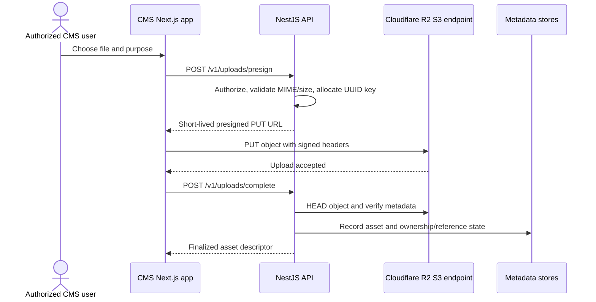
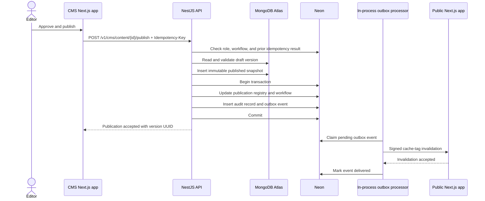

<!-- markdownlint-disable MD012 MD013 -->

# GEC Digital Platform Architecture

> **Status:** Target architecture for implementation
> **Last updated:** 2026-09-20
> **Audience:** Engineers, reviewers, and platform operators
> **Related specifications:** `docs/GEC_Website_Site_Map_Frozen.md`, `docs/GEC_CMS_Site_Map_Frozen.md`, `cms-wireframes/CMS-ARCHITECTURE.md`, `cms-copilot-integration.md`, and `google-forms-agent-integration.md`

## 1. Purpose and scope

This document defines the target architecture for the Galgotias Entrepreneurship Cell (GEC) public website and content management system. It covers service boundaries, data ownership, API responsibilities, authentication, media storage, content publication, consistency, failure handling, and the decisions behind the selected platforms.

This is an MVP architecture with a staging environment. It deliberately uses a modular monolith and managed services. It does not introduce microservices, Redis, a message broker, Kubernetes, or multi-region failover. Those additions require measured demand and a documented architecture decision.

### 1.1 Goals

- Let authorized GEC staff manage all modules defined in the frozen CMS site map.
- Publish approved content to the public site without redeploying either frontend.
- Keep public pages fast through Vercel caching and Cloudflare's R2-backed CDN.
- Keep relational workflows and flexible content in stores suited to their data models.
- Make writes auditable, retries idempotent, and partial failures recoverable.
- Prevent browsers and frontend applications from receiving database or R2 credentials.
- Let authorized CMS staff use Gemini for reviewed tasks without giving the model direct authority.
- Create and manage Google-hosted Forms without adding public form traffic to the GEC API.

### 1.2 Non-goals

- General-purpose website building outside the approved GEC page and module model.
- Direct database access from either Next.js application.
- Strong ACID transactions spanning Neon and MongoDB.
- Real-time collaborative document editing.
- Active-active regional deployment for the MVP.
- A custom public form renderer or submission endpoint for agent-created Google Forms.

## 2. Architecture principles

1. **The API is the trust boundary.** NestJS is the only application component allowed to access Neon, MongoDB Atlas, privileged R2 operations, Gemini, or Google Workspace APIs.
2. **Every datum has one authority.** Core Neon owns platform transactions; Forms Neon owns Google Forms integration state; MongoDB owns CMS documents; R2 owns platform binaries; Google Forms owns its responses.
3. **References cross stores, queries do not.** Services exchange stable UUIDs; there are no cross-database joins.
4. **Published content is immutable.** Editing creates a new draft or version instead of mutating the snapshot currently served to the public.
5. **Publication is retriable.** A transactional outbox separates committing publication state from notifying the public frontend.
6. **Public delivery and privileged authoring are separate.** The public app exposes no CMS or storage credentials and reads published projections only.
7. **Start simple and measure.** The NestJS modular monolith can later split by measured bottlenecks without changing public contracts.

## 3. System context



The platform has four public origins in production:

| Origin | Responsibility |
| --- | --- |
| `www.<domain>` | Public Next.js application on Vercel |
| `cms.<domain>` | Protected CMS Next.js application on Vercel |
| `api.<domain>` | NestJS REST API on Render |
| `media.<domain>` | Public, cached R2 media through Cloudflare |

## 4. Container architecture



### 4.1 Frontend applications

The public website and CMS are independent Next.js applications and independent Vercel projects. They may share design-system packages in the future, but they have separate builds, environment variables, access controls, domains, and rollback histories.

- **Public app:** renders public pages, retrieves only published content, tags cached API reads, and exposes a server-only cache-revalidation route.
- **CMS app:** renders the administration experience described by the frozen 11-module CMS information architecture. It never decides authorization; it displays permissions returned by the API and treats API denial as authoritative.

### 4.2 NestJS modular monolith

One Render web service hosts a NestJS application divided into modules. Modules use internal interfaces rather than network calls.

| Module | Primary responsibility |
| --- | --- |
| Auth | Login, logout, refresh rotation, password reset, sessions, and account lockout |
| Authorization | Roles, permissions, team scopes, and policy guards |
| Content | Drafts, version validation, workflow transitions, publication registry, and public projections |
| People and teams | Leadership, mentors, members, teams, and recruitment configuration |
| Initiatives and stories | Programs, FAQs, editorial stories, featured placements, and lifecycle rules |
| Stakeholders | Startups, partners, speakers, and alumni |
| Media | R2 signing, object finalization, metadata, references, and deletion policy |
| Submissions | Initiative applications, recruitment, pitches, contact requests, and exports |
| Copilot | Gemini requests, tool policy, proposals, confirmation, streaming, retention, and usage controls |
| Google Forms | Form plans, Google API execution, manual-step verification, response sync, and Sheet export |
| Audit | Immutable actor/action/resource summaries and security events |
| Outbox | Idempotent delivery of cache invalidation and other post-commit effects |
| Health | Liveness, readiness, dependency checks, and build information |

The service binds to `0.0.0.0:$PORT` on Render. It remains stateless: local disk is never used for durable uploads, sessions, or jobs.

## 5. Data ownership

### 5.1 Source-of-truth matrix

| Store | Authoritative data | Explicitly not stored here |
| --- | --- | --- |
| Neon PostgreSQL | Users, password hashes, refresh sessions, roles, permissions, user/team scopes, submissions, submission-file references, content workflow state, publication registry, audit records, and outbox events | Rich page bodies, binary file data |
| Neon Forms project | Google Form registry and revisions, form plans, manual requirements, on-demand response cache, Sheet mappings, export idempotency, and Google action logs | User accounts, CMS documents, authoritative Google responses |
| MongoDB Atlas | CMS draft documents, page compositions, reusable content blocks, SEO fields, global site settings, content revisions, and immutable published snapshots | Passwords, sessions, RBAC grants, submission workflow, binary file data |
| Cloudflare R2 | Public images/video/documents and private submission attachments | Authorization rules, workflow state, searchable business metadata |
| Google Forms and Drive | Managed Google Form bodies, responder experience, authoritative responses, and upload-enabled Form files in the automation account's My Drive | GEC users, RBAC, copilot conversations, integration idempotency |
| Google Sheets | Operator-selected response exports | Authoritative responses or workflow state |

The existing CMS modules map to these authorities as follows:

- People, teams, initiatives, stories, stakeholders, hero campaigns, navigation, and global settings use MongoDB documents for flexible content and Neon rows for approval/publication state.
- Users, permissions, audit logs, and application submissions are relational and remain in Neon.
- The media library stores searchable asset metadata and references in the API's databases while the binary object remains in R2.
- Core Neon stores copilot conversations for seven days and longer-lived action metadata without expired prompt bodies.
- Forms Neon is a separate Neon project. It stores integration control state and cached Google responses without cross-project foreign keys.
- Google Forms remains authoritative for Google-managed responses; the CMS refreshes its Forms Neon cache only on demand.
- Analytics may initially use provider telemetry plus relational aggregate records. A dedicated analytics store is out of scope for the MVP.

### 5.2 Cross-store identifiers

- NestJS generates a UUID for every logical entity before the first write.
- UUIDs are stored as PostgreSQL `uuid` values and canonical lowercase strings in MongoDB.
- MongoDB `_id` values are internal implementation details and never appear in public API contracts.
- R2 keys contain generated UUIDs, not database sequence numbers or unsanitized user paths.
- A Neon publication record points to one immutable MongoDB snapshot UUID and version.
- Deleting an entity is a state transition. Physical deletion is performed only after reference and retention checks.

### 5.3 No distributed transactions

Core Neon, Forms Neon, MongoDB, and Google APIs do not participate in one ACID transaction. Cross-store commands use ordered writes, idempotency keys, immutable versions, and reconciliation:

- A MongoDB snapshot written before the Neon commit is invisible because the public API resolves content through Neon's publication registry.
- If the Neon transaction fails, the unreferenced snapshot is safe and later identified by reconciliation.
- Post-commit effects are inserted into `outbox_events` in the same Neon transaction as the publication record.
- Consumers must accept duplicate delivery and use the event UUID as an idempotency key.
- Google Form create/update/publish actions record a local idempotency attempt before external execution and reconcile ambiguous results before retrying.
- Stable core-user UUIDs may be recorded in Forms Neon, but no foreign keys cross Neon projects.

## 6. API boundaries and contracts

All API routes are versioned under `/v1`, use JSON unless transferring an export, and return a stable request ID. Validation occurs at the edge of the NestJS application. Errors use a consistent problem shape containing `status`, `code`, `title`, `detail`, and `requestId`.

| Route group | Audience | Behavior |
| --- | --- | --- |
| `/v1/auth/*` | CMS | Login, refresh, logout, password reset, and current-session inspection |
| `/v1/public/*` | Public app | Read-only published projections; never returns drafts or private object keys |
| `/v1/cms/*` | CMS | Permission-guarded CRUD, workflow, preview, publishing, submissions, and audit views |
| `/v1/cms/copilot/*` | CMS | Gemini conversations, streamed task turns, expiring proposals, and confirmed actions |
| `/v1/cms/google-forms/*` | CMS | Form planning, create/update, manual verification, publish/close, response sync, and Sheet export |
| `/v1/uploads/presign` | CMS or authorized submission flow | Validates intent and returns one short-lived R2 operation |
| `/v1/uploads/complete` | CMS or authorized submission flow | Verifies the object and records metadata/reference state |
| `/health/live` | Render | Process liveness only; does not call dependencies |
| `/health/ready` | Render and operators | Confirms the API can serve traffic and critical dependencies are reachable |

### 6.1 Contract rules

- CMS mutations use optimistic concurrency through an entity version or `If-Match` value. Stale edits return `409 Conflict`.
- Publish and upload-intent operations accept an `Idempotency-Key` header.
- List endpoints use cursor pagination and bounded page sizes.
- Dates are ISO 8601 UTC strings. Display timezone conversion happens in the frontend.
- Public responses contain resolved public media URLs, not R2 credentials or private keys.
- Breaking contract changes require a new API version or a backward-compatible migration window.
- Gemini mutations and every Google write use an expiring one-time confirmation plus an idempotency key.
- Response-filtering requests send Form field metadata to Gemini, but return response rows directly from NestJS to the CMS.

## 7. Core request flows

### 7.1 Public content read



If the API is temporarily unavailable, previously cached public content may continue to be served. Uncached dynamic operations, such as form submissions, fail closed with a retryable user message.

### 7.2 Direct media upload



Presigned URLs use the R2 S3 API endpoint, not the public custom domain. They are bearer credentials, are restricted to one key and operation, and expire quickly. Browser uploads must send the signed `Content-Type` and any checksum headers exactly as issued.

### 7.3 Content publication



The public API never selects the newest MongoDB version on its own. It serves only the snapshot referenced by the committed Neon publication registry. Cache invalidation targets content tags and affected paths; the expected control-plane target is that an invalidation is accepted within five seconds under normal conditions. Rendering may use stale-while-revalidate behavior as configured by the public app.

## 8. Object storage and CDN design

Each cloud environment has two buckets:

| Bucket pattern | Access | Contents |
| --- | --- | --- |
| `gec-public-media-<environment>` | Read-only through `media.<domain>` in production | Approved website images, videos, logos, and public documents |
| `gec-private-submissions-<environment>` | Private; access only through authorized signed operations | Pitch decks, application attachments, exports, and other restricted files |

Recommended key patterns are:

```text
public/<entity-type>/<entity-uuid>/<asset-uuid>/v<version>-<safe-name>
private/submissions/<submission-uuid>/<asset-uuid>/<safe-name>
```

Rules:

- Public objects use immutable versioned keys and long-lived cache headers. Replacing media creates a new key and updates the content reference.
- Production public delivery uses an R2 custom domain with Cloudflare caching; the `r2.dev` endpoint is disabled.
- Private bucket access is never enabled through a public domain.
- The API checks role, ownership, workflow, MIME type, declared size, actual size, and key prefix before finalization.
- Bucket CORS permits only the exact CMS/public origins and required methods and headers.
- Asset metadata includes UUID, bucket class, key, MIME type, size, checksum when available, creator, timestamps, state, and reference count.
- Live references block hard deletion. Deletion first marks the asset inactive and moves it into a retention workflow.
- Private downloads receive short-lived presigned GET URLs only after authorization.

## 9. Authentication and authorization

### 9.1 Authentication

NestJS owns email/password authentication for CMS staff.

- Passwords are hashed with Argon2id using reviewed, versioned parameters tuned for the production service size.
- Login responses issue a short-lived access token and a rotating refresh session.
- The CMS holds the access token in memory. The refresh token is stored in a `Secure`, `HttpOnly` cookie scoped to the API refresh path.
- Refresh tokens are stored as hashes in Neon. Rotation invalidates the prior token; reuse invalidates the entire token family.
- Password-reset tokens are random, single-use, hashed at rest, and expire after a short configured interval.
- Login and reset routes are rate limited. Repeated failures produce a temporary account/IP throttle and an audit event.
- Logout revokes the active refresh session. Administrative account suspension revokes all sessions.

### 9.2 Authorization

Authorization is evaluated in NestJS guards and policies using Neon data. UI visibility is a convenience, not a security control.

The baseline roles are those defined in the CMS architecture: Super Admin, Core Team Admin, Team Head, Content Editor, and Viewer. Team Head permissions include a team scope. Publishing, user administration, export, private-file access, and cache purge are explicit permissions rather than assumptions based on route names.

### 9.3 Web security

- CORS uses exact allowlisted origins and credential settings; wildcard origins are forbidden with credentials.
- State-changing requests validate the `Origin` header. Cookie-authenticated refresh/logout routes also use CSRF protection.
- Security headers include a restrictive Content Security Policy, HSTS, frame restrictions, MIME sniffing protection, and a deliberate referrer policy.
- Secrets exist only in provider secret stores and local ignored environment files.
- Logs redact passwords, tokens, cookies, presigned URLs, database URLs, and private submission contents.
- Public-form endpoints use validation, rate limits, bot controls where needed, and generic responses that do not reveal internal records.

## 10. Consistency, retry, and reconciliation

### 10.1 Consistency model

- Neon transactions provide strong consistency for authorization, workflow transitions, submissions, audit insertion, publication pointers, and outbox insertion.
- MongoDB operations are atomic at the content-document or version-document level.
- Publication across both stores is eventually consistent but safe: only a Neon-committed snapshot reference is visible publicly.
- CDN and Next.js caches are eventually consistent after publication. Cache keys include environment and resource identity.

### 10.2 Outbox processing

The MVP runs the outbox processor inside the NestJS web service. It claims rows with database locking, uses the outbox UUID as the delivery idempotency key, and records attempt count, next-attempt time, last error, and delivery time.

Retries use capped exponential backoff with jitter. Exhausted events enter a failed state visible to operators and can be retried from an authenticated administrative action. A future dedicated Render worker may run the same processor without changing the outbox schema.

### 10.3 Reconciliation

A scheduled reconciliation task reports, but does not immediately delete:

- MongoDB published snapshots not referenced by Neon after the retention threshold.
- Neon publication records whose snapshot is missing.
- R2 objects that were uploaded but never finalized.
- Asset records pointing to missing R2 objects.
- Outbox events that are stuck or repeatedly failing.

Destructive cleanup is a separate, audited action after the retention window.

## 11. Observability and operational targets

Every API request receives or creates a request ID. Structured JSON logs include timestamp, level, environment, service version, request ID, actor UUID when known, route template, status, latency, and safe error code.

Baseline monitoring covers:

- Render instance health, restarts, CPU, memory, request rate, latency, and error rate.
- `/health/live` and `/health/ready` from an external uptime check.
- Neon connection utilization, slow queries, storage, and failed migrations.
- MongoDB Atlas connections, latency, storage, and replication/backup state.
- R2 request errors, upload finalization failures, and public cache behavior.
- Vercel build failures, function errors, cache invalidation failures, and Web Vitals.
- Application metrics for login failures, rejected authorization, publish duration, outbox backlog, submission failures, and reconciliation findings.
- Gemini latency, token usage, invalid tool requests, denied tools, action confirmations, and retention-cleanup lag.
- Google OAuth health, Forms/Sheets quota and error rates, manual-step backlog, response-cache freshness, and export failures.

Alerts must identify the environment, affected component, first failing request ID or event UUID, and the runbook section to use.

## 12. Failure modes

| Failure | Expected behavior | Recovery |
| --- | --- | --- |
| Neon unavailable | Authenticated writes and publication fail closed; readiness fails | Restore connectivity; retry idempotent requests; verify outbox backlog |
| MongoDB unavailable | CMS document reads/writes fail; relational submissions may continue if their path does not need MongoDB | Restore connectivity; retry; reconcile publication references |
| R2 upload URL expired | PUT is rejected; no asset record is finalized | Request a new presigned URL and repeat the upload |
| Upload succeeds but finalization fails | Object is private/unreferenced and not displayed | Retry completion with the same upload UUID; reconciliation later flags it |
| Snapshot written but Neon commit fails | Snapshot remains invisible and unreferenced | Retry publish idempotently or allow reconciliation to flag it |
| Cache invalidation fails | Publication remains committed; old cached content may be served | Outbox retries; operator can replay the event or purge the affected tag/path |
| Public API unavailable | Cached pages continue where available; cache misses fail | Restore API; avoid purging known-good cached content during outage |
| Migration fails | New API release must not receive traffic | Render cancels deployment; fix or forward-migrate before retry |
| Credential compromise | Affected integration may be used until revoked | Revoke, rotate, redeploy/restart consumers, and audit access |
| Gemini unavailable or malformed output | No action executes; normal CMS functions remain available | Retry later or disable the copilot feature flag; inspect safe usage/error telemetry |
| Copilot confirmation is stale or replayed | Mutation is rejected or returns its prior idempotent result | Refresh the target and create a new proposal when necessary |
| Google OAuth revoked | Google Forms actions and sync fail closed; unrelated CMS behavior continues | Reconnect the automation account and verify scopes before retrying |
| Google Form changed externally | Managed update returns conflict and preserves the external Form | Fetch the new revision and require a fresh diff/confirmation |
| Manual file-upload setup incomplete | Google Form publication remains blocked | Open the Google edit URL, add the item, and run verification again |
| Sheet export partially fails | Successful response IDs remain recorded and are not duplicated | Retry only failed/unexported responses after correcting the cause |

## 13. Scaling triggers

The MVP remains a single NestJS service until measurements justify change.

| Signal | First response | Possible later change |
| --- | --- | --- |
| API CPU or latency saturation | Profile, index, cache public reads, and scale Render instances | Split high-load modules only if independent scaling remains necessary |
| Neon connection pressure | Confirm pooled runtime URL and reduce pool size per instance | Add read replicas or workload-specific endpoints when justified |
| Outbox delay breaches publishing target | Tune batch/claim behavior | Move the same processor to a dedicated Render background worker |
| Repeated expensive public projections | Precompute projection on publish | Add a dedicated read model or cache after measuring hit rate |
| Large media-processing demand | Validate limits and move work off request path | Add an asynchronous media worker and queue |
| Search becomes a core feature | Add MongoDB/PostgreSQL indexes and measure quality | Adopt a search service only when native search is insufficient |
| Gemini cost or latency exceeds budget | Reduce context, output, and allowed task frequency; evaluate configured models | Add approved routing tiers only after evaluation and monitoring exist |
| Google Forms quota pressure | Batch supported updates, cache reads, and use bounded retries | Request quota changes only after measuring real workload |

## 14. Architecture decision records

### ADR-001: Separate public and CMS frontends

**Status:** Accepted

**Decision:** Deploy two independent Next.js applications on Vercel.

**Rationale:** The applications have different audiences, security posture, release cadence, and rollback needs. Independent projects keep CMS previews and environment variables away from the public build.

**Trade-off:** Shared UI code needs an explicit package or duplication, and two deployments must remain contract-compatible with one API.

**Revisit trigger:** The CMS becomes small enough that two release streams create more operational work than isolation value.

### ADR-002: Neon plus MongoDB with explicit ownership

**Status:** Accepted

**Decision:** Use Neon for relational transactions and MongoDB Atlas for CMS document bodies and immutable versions.

**Rationale:** RBAC, submissions, approvals, auditing, and publication pointers benefit from relational constraints and transactions. CMS page compositions evolve more naturally as versioned documents.

**Trade-off:** Cross-store workflows require careful ordering, reconciliation, and operational knowledge of two databases.

**Simpler alternative considered:** Store everything in PostgreSQL with JSONB. This would reduce operational complexity and should be reconsidered if MongoDB-specific flexibility is not used in practice.

**Revisit trigger:** Cross-store incidents or maintenance cost exceed the demonstrated benefit of the document model.

### ADR-003: NestJS modular monolith on Render

**Status:** Accepted

**Decision:** Run one stateless NestJS web service with internal domain modules and an in-process outbox processor.

**Rationale:** It matches the TypeScript frontend stack, centralizes policy enforcement, and minimizes MVP deployment complexity.

**Trade-off:** All modules scale together, and resource-intensive work must be kept out of request handling.

**Revisit trigger:** Profiling shows one module or background workload requires sustained, materially different scaling or isolation.

### ADR-004: R2 for object storage and public media CDN

**Status:** Accepted

**Decision:** Store binaries in separate public and private R2 buckets, upload directly with presigned URLs, and deliver public assets through a Cloudflare custom domain.

**Rationale:** Direct upload avoids routing large bodies through Render, while immutable keys make long CDN caching safe.

**Trade-off:** The application must finalize uploads, track references, configure CORS carefully, and distinguish the S3 signing endpoint from the CDN domain.

**Revisit trigger:** Required media transformations, private delivery controls, or regional constraints cannot be met reliably by the current design.

### ADR-005: Transactional outbox for publication side effects

**Status:** Accepted

**Decision:** Commit publication state and an outbox event in one Neon transaction; invalidate frontend caches asynchronously and idempotently.

**Rationale:** A cache or network outage must not roll back approved content or leave the publication result ambiguous.

**Trade-off:** Content can be committed before caches refresh, so operators need backlog visibility and retry controls.

**Revisit trigger:** Outbox volume or latency requires a dedicated worker or broker.

### ADR-006: Backend-only Gemini copilot with confirmed tools

**Status:** Accepted

**Decision:** Call Gemini from NestJS using an AI Studio API key. Read tools remain permission-scoped, while every mutation becomes an expiring proposal requiring a separate human confirmation.

**Rationale:** The model can accelerate CMS work without receiving credentials or becoming an authorization authority.

**Trade-off:** Render handles streaming/model orchestration, and assisted mutations take an additional interaction.

**Revisit trigger:** A provider or orchestration change offers materially better security, cost, or reliability without weakening tool controls.

### ADR-007: Google-hosted Forms with a separate control database

**Status:** Accepted

**Decision:** Use actual Google Forms for the responder experience and a separate Neon Forms project for integration state, on-demand response cache, and Sheet-export idempotency.

**Rationale:** Google accepts response traffic while GEC retains controlled CMS workflows and auditability.

**Trade-off:** Google API limits apply. Upload-enabled Forms require a dedicated account's My Drive and a manual file-upload-question step.

**Revisit trigger:** Google adds supported upload-question creation/Shared Drive handling, or the product requires a custom responder experience.

## 15. Official references

- [Cloudflare R2 documentation](https://developers.cloudflare.com/r2/)
- [Cloudflare R2 presigned URLs](https://developers.cloudflare.com/r2/api/s3/presigned-urls/)
- [Cloudflare R2 public buckets and custom domains](https://developers.cloudflare.com/r2/buckets/public-buckets/)
- [Neon connection pooling](https://neon.com/docs/connect/connection-pooling)
- [MongoDB Atlas documentation](https://www.mongodb.com/docs/atlas/)
- [Render web services](https://render.com/docs/web-services)
- [Render health checks](https://render.com/docs/health-checks)
- [Vercel deployments](https://vercel.com/docs/deployments/overview)
- [Next.js cache-tag revalidation](https://nextjs.org/docs/app/api-reference/functions/revalidateTag)
- [Gemini API documentation](https://ai.google.dev/gemini-api/docs)
- [Google Forms API overview](https://developers.google.com/workspace/forms/api/guides)
- [Google Workspace OAuth overview](https://developers.google.com/workspace/guides/auth-overview)
- [CMS copilot integration specification](cms-copilot-integration.md)
- [Google Forms agent integration specification](google-forms-agent-integration.md)
