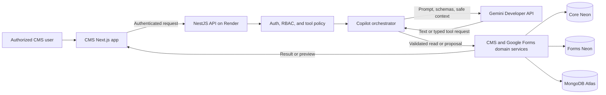
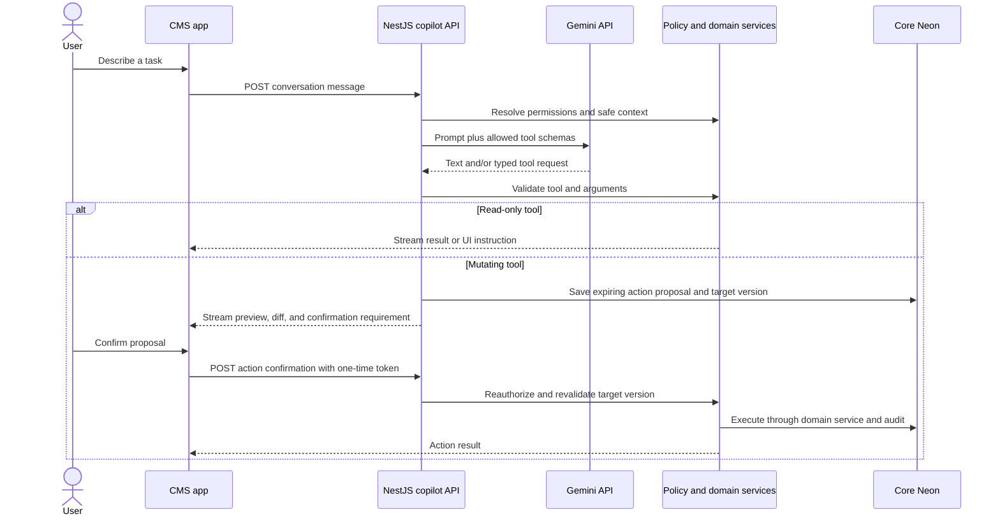

<!-- markdownlint-disable MD012 MD013 -->

# GEC CMS Gemini Copilot Integration

> **Status:** Target integration specification
> **Last updated:** 2026-09-20
> **Audience:** CMS, backend, security, and platform engineers
> **Related documents:** `architecture.md`, `deployment.md`, and `google-forms-agent-integration.md`

## 1. Purpose and scope

This document defines an internal CMS copilot powered by Gemini models through the Gemini Developer API. The copilot is a task agent for authorized GEC staff. It is not a public chatbot and is never a replacement for backend authorization or human approval.

The first release supports:

- Reading CMS content that the current user is already authorized to view.
- Drafting or proposing edits to unpublished CMS content.
- Turning a natural-language request into a validated Google Form plan.
- Proposing supported changes to an existing Google Form.
- Translating natural-language response queries into structured filters and sorting.
- Executing a mutating proposal only after an explicit, one-time confirmation.

The first release does not support:

- Publishing CMS content.
- Autonomous Google Form publication.
- User, role, permission, credential, or environment administration.
- Arbitrary URL retrieval, arbitrary SQL/NoSQL queries, or code execution.
- Editing or deleting Google Form responses.
- Reading uploaded file contents.
- Sending raw responses, respondent PII, or uploaded files to Gemini.

## 2. Architecture and trust boundaries



Trust rules:

1. Only NestJS holds `GEMINI_API_KEY`; the CMS browser never calls Gemini directly.
2. Gemini can request only tools declared by the server for the current user and screen.
3. Tool arguments are untrusted model output and must pass schema, authorization, scope, and business-rule validation.
4. Read tools execute through existing domain services, not direct database access.
5. Mutating tools create a proposal. They do not perform the mutation in the model request.
6. A separate confirmation request rechecks the actor, permission, target version, proposal expiry, and idempotency key before execution.
7. The backend, not the model, decides whether an action is allowed and what data may be returned.

## 3. Data ownership and retention

Core Neon stores:

- Conversation UUID, owner UUID, title, state, created time, and expiry time.
- User and assistant message bodies for seven days.
- Tool-call proposals, confirmation state, target resource version, and safe preview metadata.
- Usage metadata: provider, configured model identifier, latency, token counts when returned, and result status.
- Immutable action audit references without retained prompt/response bodies after expiry.

MongoDB and Forms Neon remain authoritative for CMS content and Google Forms integration state respectively. Copilot messages never become source-of-truth content.

### 3.1 Seven-day lifecycle

- `expires_at` is set to seven days after conversation creation.
- A scheduled cleanup job deletes expired message bodies, model output bodies, and transient tool context.
- Action/audit records retain actor, action type, target UUID, result, timestamps, request ID, and a content hash, but not the full prompt or response.
- A user may delete their conversation before expiry. Deletion uses the same content-removal behavior while preserving mandatory audit metadata.
- Legal or security holds are out of scope until a formal retention policy exists.

## 4. Capability and tool policy

Tools are registered server-side and filtered for each turn using the actor's role, resource scope, current CMS screen, and feature flags.

| Tool | Mode | Allowed behavior | Explicit restriction |
| --- | --- | --- | --- |
| `search_cms_content` | Read | Search permitted draft and published metadata | No private submissions or credentials |
| `get_cms_draft` | Read | Retrieve a permitted draft and its version | No cross-team access |
| `propose_cms_draft_update` | Proposal | Produce a field-level draft diff | Cannot publish, approve, or archive |
| `create_google_form_plan` | Proposal | Produce a validated `GoogleFormPlan` | Does not call Google APIs |
| `propose_google_form_update` | Proposal | Diff a managed Google Form against requested changes | Must preserve unsupported/manual items |
| `build_submission_filter` | Read | Convert intent into a validated `SubmissionFilter` | Gemini receives schema labels, not response rows |
| `publish_google_form` | Confirmed action | Publish a verified Form after separate confirmation | Requires `forms.publish`; cannot be chained silently |

The server rejects undeclared tools, unknown properties, excess array sizes, unsupported operators, and target IDs outside the actor's permission scope.

## 5. Interaction and confirmation flow



### 5.1 Confirmation token rules

- Generate an opaque cryptographically random token and store only its hash.
- Bind it to the actor UUID, proposal UUID, action type, target UUID/version, and environment.
- Expire it after a short configured interval and after first use.
- Reject a token if the actor, permission, target version, or proposal body has changed.
- Apply an idempotency key so a retried confirmation returns the original result instead of repeating the mutation.
- Google Form publication always uses a distinct proposal and confirmation from form creation or editing.

## 6. Central interfaces

The types below describe contract intent; implementation may use generated DTOs while preserving these fields and invariants.

```ts
type CopilotActionStatus =
  | "proposed"
  | "confirmed"
  | "executing"
  | "succeeded"
  | "failed"
  | "expired"
  | "superseded";

interface CopilotActionProposal<TInput = unknown, TPreview = unknown> {
  id: string;
  conversationId: string;
  actorId: string;
  actionType: string;
  targetId?: string;
  targetVersion?: string;
  input: TInput;
  preview: TPreview;
  status: CopilotActionStatus;
  idempotencyKey: string;
  confirmationRequired: true;
  expiresAt: string;
}

interface SubmissionFilter {
  formId: string;
  formRevisionId: string;
  predicates: Array<{
    fieldId: string;
    operator: "eq" | "neq" | "contains" | "in" | "gt" | "gte" | "lt" | "lte" | "is_empty";
    value?: string | number | boolean | Array<string | number>;
  }>;
  sort: Array<{ fieldId: string; direction: "asc" | "desc" }>;
  cursor?: string;
  limit: number;
}
```

`SubmissionFilter` is validated against the cached Google Form schema. Field IDs and operators must be valid for the field type. The backend executes the filter and sends rows directly to the CMS data grid; rows are not appended to subsequent Gemini context.

## 7. HTTP API

All routes require CMS authentication and use the existing error and request-ID conventions.

| Method and route | Purpose |
| --- | --- |
| `POST /v1/cms/copilot/conversations` | Create a seven-day conversation |
| `GET /v1/cms/copilot/conversations/{id}` | Read an owned/permitted active conversation |
| `POST /v1/cms/copilot/conversations/{id}/messages` | Submit a task and stream model/tool events |
| `POST /v1/cms/copilot/actions/{id}/confirm` | Consume a one-time token and execute one proposal |
| `DELETE /v1/cms/copilot/conversations/{id}` | Remove conversation bodies and transient context |

The message endpoint streams typed events using Server-Sent Events or fetch-compatible streaming:

```text
message.delta
tool.started
tool.result
action.proposed
usage
done
error
```

Streams contain no secrets or raw hidden model reasoning. Clients reconnect by request/action ID and must tolerate duplicate terminal events.

## 8. Gemini integration

- Use the official `@google/genai` package in NestJS.
- Initialize it only from the server-side `GEMINI_API_KEY`.
- Read the default model and allowed model identifiers from `GEMINI_DEFAULT_MODEL` and `GEMINI_ALLOWED_MODELS`.
- Reject a CMS-supplied model identifier not present in the server allowlist.
- Use structured output or function declarations for tool arguments; never parse operational commands from free-form prose alone.
- Set request timeouts, maximum output tokens, and per-user/conversation rate limits.
- Limit context to the current task, compact conversation history, and the minimum permitted records.
- Do not enable Google Search, URL retrieval, code execution, or undeclared built-in tools in the initial release.
- Treat model safety blocks, quota errors, malformed output, and timeouts as expected failures with safe user-facing messages.

Model identifiers are configuration because AI Studio availability and lifecycle change. A model change is deployed to staging first and must pass the evaluation suite before production promotion.

## 9. Prompt-injection and data-protection controls

- System policy and tool declarations are assembled only by the backend.
- CMS content, form text, and model output are tagged as untrusted data, never instructions.
- Retrieved content cannot add tools, change roles, expand data scope, or bypass confirmation.
- Tool inputs use allowlisted DTOs with length, count, enum, and identifier validation.
- The orchestrator caps tool-call depth and total calls per turn.
- No tool accepts raw SQL, Mongo queries, shell commands, file paths, credentials, or unrestricted URLs.
- Secret patterns and sensitive headers are redacted before logs and model requests.
- Response schemas and field labels may be sent to Gemini for filter construction; response values, emails, uploaded filenames, file IDs, and file contents may not.
- An actor's current authorization is rechecked on every read and confirmation, not cached from conversation creation.

## 10. Audit, usage, and observability

For each model turn record:

- Conversation, actor, request, and trace IDs.
- Configured model identifier and provider request status.
- Latency, timeout/cancellation state, and token usage when returned.
- Tool names requested, allowed, denied, proposed, and confirmed.
- Target UUID/version and action result without sensitive bodies.
- Estimated cost where pricing configuration is available.

Monitor model error rate, latency, token volume, action proposal/confirmation rate, denied tools, invalid schemas, retention-cleanup lag, and per-user rate-limit events. Set environment-level daily usage alerts and a kill switch that disables Gemini calls while preserving normal CMS operation.

## 11. Failure behavior

| Failure | Required behavior |
| --- | --- |
| Gemini timeout or outage | Cancel the turn, preserve no partial action, and let the user continue normal CMS work |
| Invalid structured output | Reject it, optionally retry once with the validation error, then return a safe failure |
| Unauthorized tool request | Do not execute; record a denied-tool security event |
| Proposal target changed | Mark the proposal superseded and require a fresh preview |
| Confirmation replay | Return the stored idempotent result or reject an already consumed token |
| Stream disconnected | Cancel model work where possible; reconnect by request ID without duplicating actions |
| Retention cleanup fails | Alert on cleanup lag and retry; do not silently extend retention indefinitely |
| Usage threshold exceeded | Disable new model turns or downgrade through an approved configured policy; never bypass limits silently |

## 12. Test plan

### Functional

- Create, continue, delete, and automatically expire a conversation.
- Generate a valid form plan from plain language.
- Propose a CMS draft change and display a stable field-level diff.
- Confirm an action exactly once and return the original result on an idempotent retry.
- Build supported response filters and render results without sending rows back to Gemini.

### Authorization and security

- Deny undeclared tools, excessive tool loops, arbitrary URLs, database queries, and code requests.
- Deny cross-team reads and stale permissions.
- Reject expired, replayed, wrong-actor, wrong-environment, and stale-version confirmations.
- Verify prompt injection inside CMS content cannot change tool policy.
- Verify model requests and logs contain no raw response rows, PII, upload metadata, secrets, or refresh tokens.

### Reliability and operations

- Exercise quota, timeout, malformed response, safety block, and provider outage behavior.
- Verify stream reconnect behavior and action idempotency.
- Verify seven-day cleanup and early user deletion.
- Confirm usage metrics, safe audit events, alert thresholds, and the Gemini kill switch.

## 13. Architecture decisions

### ADR-COPILOT-001: Backend-only Gemini integration

**Status:** Accepted

**Decision:** All Gemini calls go through NestJS using a server-side AI Studio API key.

**Rationale:** This keeps credentials, authorization context, tool policy, quotas, and audit behavior out of the browser.

**Trade-off:** Render handles streaming connections and model orchestration.

### ADR-COPILOT-002: Proposal and confirmation for mutations

**Status:** Accepted

**Decision:** The model can propose mutations, but a separate authenticated request executes them with a one-time confirmation token.

**Rationale:** A model response is not sufficient authority for a state change.

**Trade-off:** Tasks require an extra human interaction and proposal storage.

### ADR-COPILOT-003: Response filtering without model data access

**Status:** Accepted

**Decision:** Gemini creates a typed filter from field metadata; the backend executes it and sends rows directly to the CMS.

**Rationale:** Staff get natural-language filtering without disclosing respondent data to the model.

**Trade-off:** The copilot cannot summarize or reason over response values in the initial release.

## 14. Official references

- [Gemini API documentation](https://ai.google.dev/gemini-api/docs)
- [Google Gen AI SDK for JavaScript](https://googleapis.github.io/js-genai/)
- [Gemini function calling](https://ai.google.dev/gemini-api/docs/function-calling)
- [Gemini structured output](https://ai.google.dev/gemini-api/docs/structured-output)

