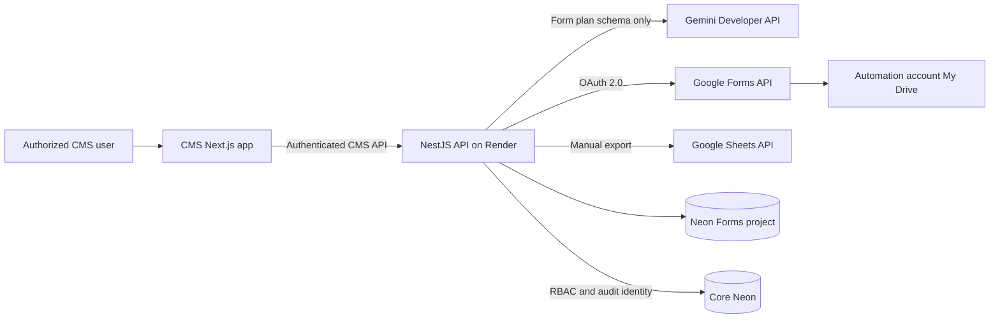
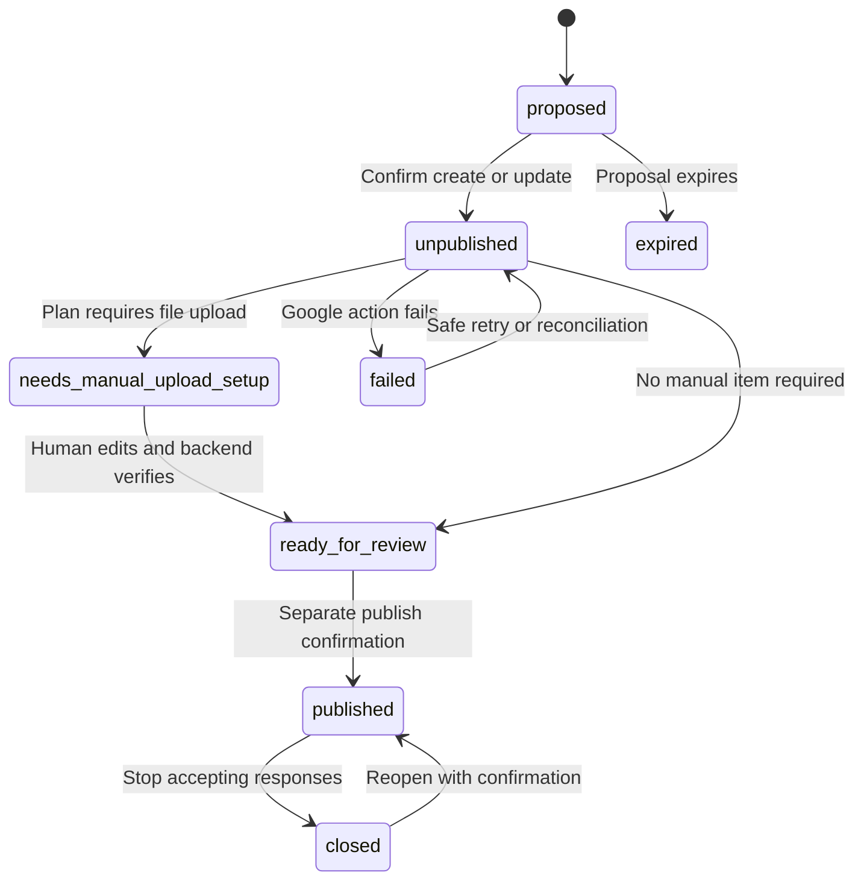
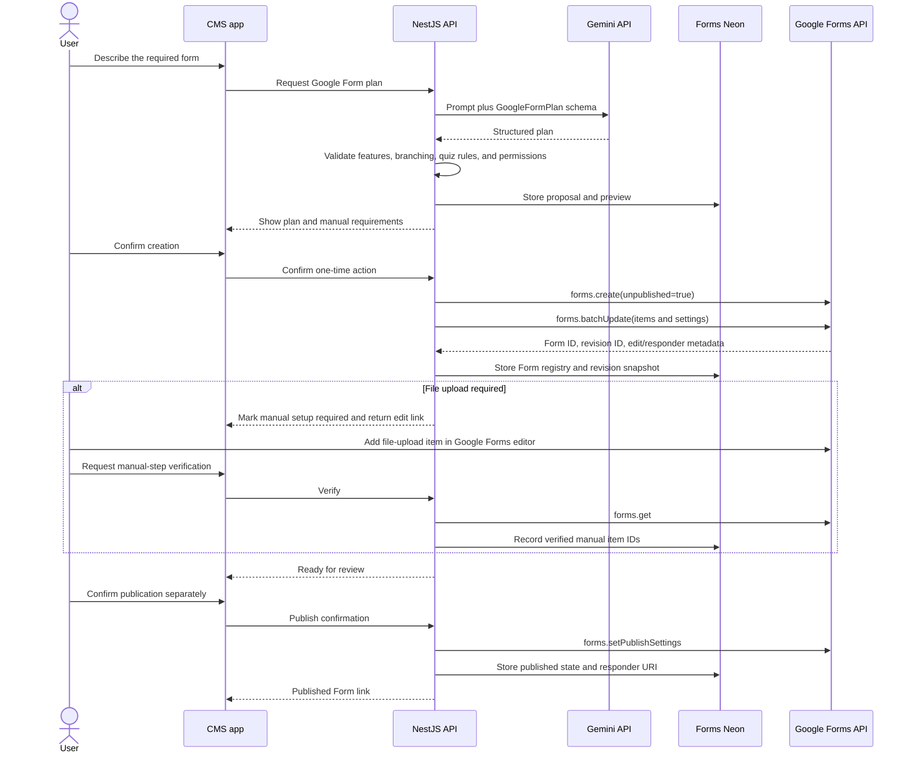

<!-- markdownlint-disable MD012 MD013 -->

# GEC Google Forms Agent Integration

> **Status:** Target integration specification
> **Last updated:** 2026-09-20
> **Audience:** CMS, backend, security, and platform engineers
> **Related documents:** `architecture.md`, `deployment.md`, and `cms-copilot-integration.md`

## 1. Purpose and scope

This document defines how the internal CMS copilot creates, customizes, verifies, publishes, reads, and exports actual Google Forms. Google hosts the responder experience and remains authoritative for responses. GEC does not build a custom public form renderer or submission API.

The integration uses:

- Gemini to convert staff intent into a structured form plan.
- NestJS to validate plans, enforce permissions, execute Google API operations, and audit actions.
- Google Forms API to create, edit, inspect, publish, close, and read responses.
- Google Drive as the ownership and file-upload location for a dedicated institutional automation account.
- Google Sheets API for an operator-triggered export to an existing workbook.
- A separate Neon Forms project for integration control state, cached responses, and export tracking.

## 2. Platform constraints

The design explicitly accepts these current Google platform constraints:

1. Google Forms API can create, update, read, and publish Forms, but it cannot create file-upload questions.
2. A Google Form located in a Shared Drive cannot accept file uploads.
3. Therefore, Forms requiring uploads remain in the dedicated automation account's My Drive.
4. A human adds or configures each file-upload question in the Google Forms editor before publication.
5. The agent verifies the manually added item through `forms.get`, but never attempts to create, rewrite, or remove it.
6. Google Forms, not Neon or Sheets, is authoritative for submitted responses.

If these platform constraints change, update this specification and add a new architecture decision before automating file-upload item creation or moving upload-enabled Forms to a Shared Drive.

## 3. Architecture



There is no public GEC Forms endpoint. Respondents open Google's `responderUri`, and Google accepts and stores their responses and upload data.

## 4. Identity and authorization

### 4.1 Gemini authentication

Gemini uses `GEMINI_API_KEY` through the backend-only Gemini Developer API integration described in `cms-copilot-integration.md`. The API key cannot authorize Google Workspace operations.

### 4.2 Google Workspace authentication

Google Forms, Drive, and Sheets use a separate OAuth 2.0 web client and a dedicated institutional automation account.

- An operator completes one consent flow and grants offline access.
- The resulting refresh token is stored only in Render's secret store.
- The automation account owns managed Forms, file-upload folders, and uploaded response files in My Drive.
- CMS users act through GEC RBAC; they never receive the automation account's tokens.
- The backend requests only the scopes needed to manage Form bodies, read responses, manage files created by the integration, and append to configured Sheets.
- OAuth revocation disables Google actions but does not disable unrelated CMS functions.

Recommended scopes are reviewed during implementation against the exact client methods:

```text
https://www.googleapis.com/auth/forms.body
https://www.googleapis.com/auth/forms.responses.readonly
https://www.googleapis.com/auth/drive.file
https://www.googleapis.com/auth/spreadsheets
```

Do not use the Gemini API key for Workspace APIs, and do not expose OAuth client secrets or refresh tokens to the browser.

## 5. Form lifecycle



Lifecycle rules:

- `proposed` exists only in Forms Neon and has no external Google Form side effect.
- Creating or updating an actual Form requires one action confirmation.
- The Form is created explicitly unpublished and not accepting responses.
- File-upload requirements force `needs_manual_upload_setup`; publication is blocked.
- Verification rereads the Form, records the manual item IDs, and confirms required settings.
- Publication is always a separate action proposal requiring `forms.publish`.
- Closing or reopening responses is an audited confirmed action.
- A Google Form deleted outside GEC is marked `external_missing` after reconciliation; the registry row is not silently deleted.

## 6. End-to-end creation and publication



## 7. Supported planning model

Gemini produces a provider-neutral plan which the backend compiles into supported Google Forms API requests. The backend rejects unknown item types and impossible routing before any Google call.

```ts
type GoogleFormLifecycleState =
  | "proposed"
  | "unpublished"
  | "needs_manual_upload_setup"
  | "ready_for_review"
  | "published"
  | "closed"
  | "failed"
  | "external_missing";

type GoogleFormItemPlan =
  | { kind: "text"; key: string; title: string; paragraph: boolean; required: boolean }
  | { kind: "choice"; key: string; title: string; mode: "radio" | "checkbox" | "dropdown"; options: string[]; required: boolean }
  | { kind: "scale"; key: string; title: string; low: number; high: number; lowLabel?: string; highLabel?: string; required: boolean }
  | { kind: "date"; key: string; title: string; includeTime: boolean; includeYear: boolean; required: boolean }
  | { kind: "time"; key: string; title: string; duration: boolean; required: boolean }
  | { kind: "rating"; key: string; title: string; levels: number; required: boolean }
  | { kind: "grid"; key: string; title: string; mode: "radio" | "checkbox"; rows: string[]; columns: string[]; required: boolean }
  | { kind: "section"; key: string; title: string; description?: string }
  | { kind: "text_block"; key: string; title: string; description?: string }
  | { kind: "image" | "video"; key: string; title?: string; source: string }
  | { kind: "file_upload_manual"; key: string; title: string; instructions: string };

interface GoogleFormPlan {
  title: string;
  documentTitle: string;
  description?: string;
  settings: {
    isQuiz: boolean;
    collectEmail?: "verified" | "responder_input" | "none";
  };
  items: GoogleFormItemPlan[];
  branching: Array<{
    sourceKey: string;
    option: string;
    destinationSectionKey: string | "submit";
  }>;
  grading?: Array<{
    itemKey: string;
    points: number;
    acceptedAnswers?: string[];
    correctFeedback?: string;
    incorrectFeedback?: string;
  }>;
  requiredManualSteps: Array<{
    kind: "file_upload_question";
    itemKey: string;
    instructions: string;
  }>;
}

interface GoogleFormRecord {
  id: string;
  googleFormId: string;
  ownerAccount: string;
  editUrl: string;
  responderUrl?: string;
  lifecycleState: GoogleFormLifecycleState;
  revisionId: string;
  planVersion: number;
  manualStepsVerifiedAt?: string;
  configuredSpreadsheetId?: string;
  configuredSheetTab?: string;
  lastResponseSyncAt?: string;
}
```

The compiler may support only features exposed by the current Google Forms API. A plan containing a file upload produces a manual placeholder and instructions rather than a create-item request.

## 8. Editing and concurrency

- Fetch the current Form and opaque Google `revisionId` before preparing a diff.
- Store a normalized snapshot of managed item IDs and stable plan keys in Forms Neon.
- Distinguish agent-managed items from manual or unknown items.
- Never delete, move, or rewrite a manual file-upload item unless a human performs that edit in Google Forms.
- Default to preserving unknown or newly introduced item types.
- Use Google write controls where supported and reject stale revisions with `409 Conflict`.
- If the Form changed externally, refresh the snapshot and require a new preview/confirmation.
- Use an idempotency key for each confirmed create/update/publish attempt. Store the Google result before returning success.
- Reconciliation must locate an ambiguous create by stored request metadata before retrying to avoid duplicate Forms.

## 9. Forms Neon data model

The separate Neon Forms project is the integration control plane, not the authoritative response store.

| Table/logical record | Purpose |
| --- | --- |
| `google_forms` | Form ID, owner, URLs, lifecycle, revision, plan version, and timestamps |
| `google_form_revisions` | Normalized API snapshots, managed item mapping, and content hashes |
| `google_form_plans` | Validated plan bodies, proposal status, actor UUID, and expiry |
| `manual_requirements` | Required upload setup, instructions, observed Google item IDs, and verification |
| `response_sync_runs` | On-demand sync cursor/time, result, counts, request ID, and errors |
| `response_cache` | Cached response ID, Form revision, safe structured answers, timestamps, and source hash |
| `sheet_mappings` | Spreadsheet ID, tab name, column map, configured revision, and state |
| `sheet_exports` | Response/export destination idempotency record, row, attempts, and error |
| `google_action_log` | External operation type, actor UUID, idempotency key, status, Google request metadata, and safe error |

Forms Neon records stable core-user UUIDs without cross-project foreign keys. Core Neon remains authoritative for users, roles, permissions, copilot conversations, and platform audit identity.

## 10. CMS API

All routes require CMS authentication and server-side permission checks.

| Method and route | Purpose | Permission |
| --- | --- | --- |
| `POST /v1/cms/google-forms/plans` | Create a validated form proposal | `forms.create` |
| `GET /v1/cms/google-forms` | List managed Forms | `forms.read` |
| `GET /v1/cms/google-forms/{id}` | Read registry, snapshot, and lifecycle | `forms.read` |
| `POST /v1/cms/google-forms` | Confirm and create an unpublished Google Form | `forms.create` |
| `PATCH /v1/cms/google-forms/{id}` | Confirm and apply a reviewed update | `forms.edit` |
| `POST /v1/cms/google-forms/{id}/verify-manual-steps` | Reread and verify manual upload setup | `forms.edit` |
| `POST /v1/cms/google-forms/{id}/publish` | Separately confirm publication | `forms.publish` |
| `POST /v1/cms/google-forms/{id}/close` | Stop accepting responses | `forms.publish` |
| `POST /v1/cms/google-forms/{id}/responses/sync` | Refresh the response cache on demand | `forms.responses.read` |
| `GET /v1/cms/google-forms/{id}/responses` | Filter cached responses | `forms.responses.read` |
| `POST /v1/cms/google-forms/{id}/sheet-export` | Manually append selected/unexported responses | `forms.responses.export` |

Creation, update, publish, close/reopen, and Sheet export use one-time action confirmations and idempotency keys. Sync and reads never change Google Form responses.

## 11. On-demand response synchronization

Google Forms remains authoritative. The CMS cache exists for fast filtering and controlled export.

1. An authorized user opens the responses view or selects Refresh.
2. NestJS checks the last-sync timestamp and begins an on-demand sync when needed.
3. The backend pages through `forms.responses.list`, respecting quota and retry guidance.
4. It upserts by Google response ID and source update timestamp/hash.
5. It records a sync run and exposes freshness in the CMS.
6. Removed or inaccessible responses are marked unavailable after reconciliation rather than silently hard-deleted.

The copilot receives only Form field identifiers, labels, and types to produce a `SubmissionFilter`. NestJS validates and executes the filter against `response_cache`, then returns rows directly to the CMS grid. The filtered rows are not model context.

## 12. Manual Google Sheets export

Each managed Form may reference one existing Google Spreadsheet. The operator shares that workbook with the automation account or ensures the automation account owns it.

Rules:

- Export is never automatic.
- Each Form revision uses a separate tab to avoid silent column drift.
- Tab names use a stable safe form slug plus plan version; collisions receive a deterministic suffix.
- Fixed metadata columns precede answer columns: response ID, created time, submitted time, Form ID, and Form revision.
- Answer columns use stable Google question/item IDs rather than labels as identity; human-readable labels appear in headers.
- File-upload answers are exported as Drive URLs/IDs visible only to authorized Drive users. Files are not copied or made public.
- The backend uses `spreadsheets.values.append` and preserves cell values as data rather than formulas unless explicitly escaped/allowed.
- A unique Forms Neon record on `(google_form_id, google_response_id, spreadsheet_id, tab_name)` prevents duplicate rows.
- Partial batches record per-response status. Retry includes only unexported or failed records.
- If headers or mapping no longer match, stop the export and require a new revision tab or an authorized remap.

## 13. Security and privacy

- Only the dedicated account's OAuth token may call Google APIs; CMS user tokens cannot be exchanged for it.
- Store OAuth client secret and refresh token only in provider secret storage.
- Redact access tokens, refresh tokens, authorization headers, responder answers, uploaded filenames, and private Drive links from logs.
- Google Form response and file access requires explicit `forms.responses.read` or export permission.
- File-upload answers remain in the automation account's My Drive and inherit Google's access controls. Do not expose direct links on public pages.
- Gemini never receives response values, respondent identity, uploaded filenames, file IDs, links, or contents.
- Publishing displays the resulting responder access mode and requires an authorized human to confirm it.
- External changes are treated as untrusted and revalidated before use.

## 14. Failure and recovery

| Failure | Required behavior |
| --- | --- |
| Gemini returns an invalid plan | Reject before Google calls; show validation errors or retry once |
| OAuth consent revoked or token invalid | Mark integration disconnected, stop actions, and require an operator reconnect |
| Forms API quota or transient error | Use bounded exponential backoff and preserve the idempotency record |
| Create result is ambiguous | Reconcile using action metadata before retrying; do not blindly create again |
| Google revision changed | Return conflict, fetch the external version, and require a fresh diff |
| Manual upload item missing | Keep `needs_manual_upload_setup` and block publication |
| Form deleted externally | Mark `external_missing`; preserve registry and audit data |
| Response sync partly fails | Keep prior cache, record cursor/error, and resume safely |
| Sheet export partly fails | Preserve successful idempotency records and retry only remaining responses |
| Sheet mapping changed | Stop before append and require remapping/new version tab |

## 15. Observability and operations

Monitor:

- Google OAuth connection health and token-refresh failures.
- Forms API read/write latency, quota usage, 4xx/5xx responses, and retry counts.
- Managed Form counts by lifecycle state and age in manual-setup state.
- External revision conflicts and missing Forms.
- Response-sync duration, freshness, pagination, and cached response counts.
- Sheet export counts, duplicates prevented, failures, and schema mismatches.
- Confirmation proposals, expirations, replays, and actor permissions.

An operator dashboard should show disconnected credentials, Forms awaiting manual setup, unpublished Forms awaiting review, failed Google actions, stale response caches, and failed Sheet exports.

## 16. Test plan

### Form planning and lifecycle

- Generate every supported API item type, sections, branching, quiz settings, and grading combinations.
- Reject unsupported item types and invalid section destinations before Google calls.
- Create a Form unpublished, preserve its Google ID, and verify the stored revision.
- Confirm file-upload plans enter `needs_manual_upload_setup`.
- Verify a human-created upload item and preserve it through later agent edits.
- Block publication until manual requirements pass and a separate publish confirmation is consumed.
- Close and reopen responses with correct permissions and audit entries.

### Concurrency and authorization

- Detect external edits through revision mismatch and require a new preview.
- Preserve manual and unknown items during managed updates.
- Reject wrong-role, wrong-user, expired, replayed, and stale-target confirmations.
- Reconcile an ambiguous create/update without duplicate Forms.
- Verify OAuth revocation and reconnection behavior.

### Responses and Sheets

- Sync paginated responses on demand and expose cache freshness.
- Resume after quota, timeout, and partial-page failures.
- Filter and sort cached responses without sending values to Gemini.
- Create revision-specific headers and append selected/unexported responses.
- Prevent duplicate rows across retries and concurrent export attempts.
- Stop safely on Sheet header drift and preserve file permissions in exported Drive links.

## 17. Architecture decisions

### ADR-FORMS-001: Google-hosted responder experience

**Status:** Accepted

**Decision:** Use actual Google Forms rather than a custom GEC form renderer or submission API.

**Rationale:** Google accepts public response traffic and provides the familiar responder experience, reducing GEC backend load.

**Trade-off:** The integration is limited by Google Forms API capabilities and ownership rules.

### ADR-FORMS-002: Manual file-upload setup in My Drive

**Status:** Accepted

**Decision:** A dedicated institutional account owns upload-enabled Forms in My Drive, and a human adds file-upload questions before publication.

**Rationale:** The supported API cannot create upload questions, and Shared Drive Forms cannot accept uploads.

**Trade-off:** File-upload Forms cannot be fully created without a manual checkpoint.

### ADR-FORMS-003: Separate Forms Neon project

**Status:** Accepted

**Decision:** Store integration control state, cached responses, and export idempotency in a separate Neon project.

**Rationale:** Form integration data and credentials have a distinct operational lifecycle and failure boundary from the core platform.

**Trade-off:** The API operates two PostgreSQL connections and cannot use foreign keys across projects.

### ADR-FORMS-004: On-demand response cache and manual Sheet export

**Status:** Accepted

**Decision:** Fetch responses only when staff request a refresh and export to an existing Sheet only after an authorized manual action.

**Rationale:** This avoids Pub/Sub/watch renewal complexity and prevents Sheets from becoming an accidental source of truth.

**Trade-off:** CMS response data is not real-time until refreshed.

## 18. Official references

- [Google Forms API overview](https://developers.google.com/workspace/forms/api/guides)
- [Google Forms resource and item types](https://developers.google.com/workspace/forms/api/reference/rest/v1/forms)
- [Create a Google Form](https://developers.google.com/workspace/forms/api/reference/rest/v1/forms/create)
- [Batch update a Google Form](https://developers.google.com/workspace/forms/api/reference/rest/v1/forms/batchUpdate)
- [Publish and manage responders](https://developers.google.com/workspace/forms/api/guides/publish-form)
- [Google Form responses](https://developers.google.com/workspace/forms/api/reference/rest/v1/forms.responses)
- [Google Forms API limits](https://developers.google.com/workspace/forms/api/limits)
- [Google Workspace OAuth overview](https://developers.google.com/workspace/guides/auth-overview)
- [Google Sheets append values](https://developers.google.com/workspace/sheets/api/reference/rest/v4/spreadsheets.values/append)
- [Shared Drive Forms upload limitation](https://support.google.com/a/users/answer/12382709)

